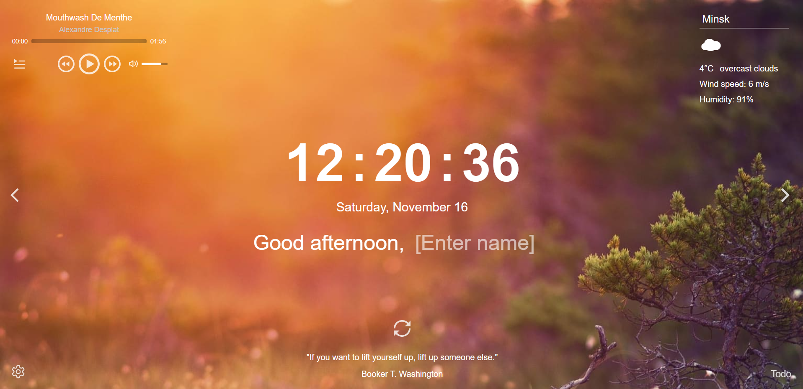

# Momentum
## Project's Description
Momentum is an educational project of a web application. It's an analogue of eponymous application from Chrome store. Done on the [RS School JavaScript / Front-end Pre-School Course](https://rs.school/courses/javascript-preschool-ru).  

The application shows the time and the user name. The background image and greeting change depending on the time of day.
## Demo
Checkout Momentum demo [here](https://whiterabit8-momentum.netlify.app/).
## Features
* Local time.
* User name, stored in local storage.
* The background image and greeting change depending on the time of day.
* Image slider and possibility to choose image source and tag for image source.
* Weather widget with possibility to choose the city.
* Audio player with playlist.
* Quote of the day.
* Todo list.
* Two languages - English and Russian.
* Possibility to show and hide all widgets.
## Screenshots

## Technologies
* HTML
* CSS
* JavaScript